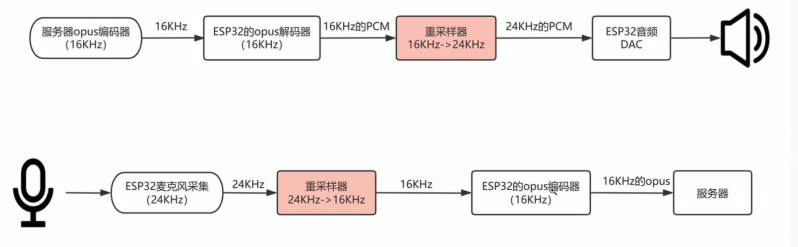
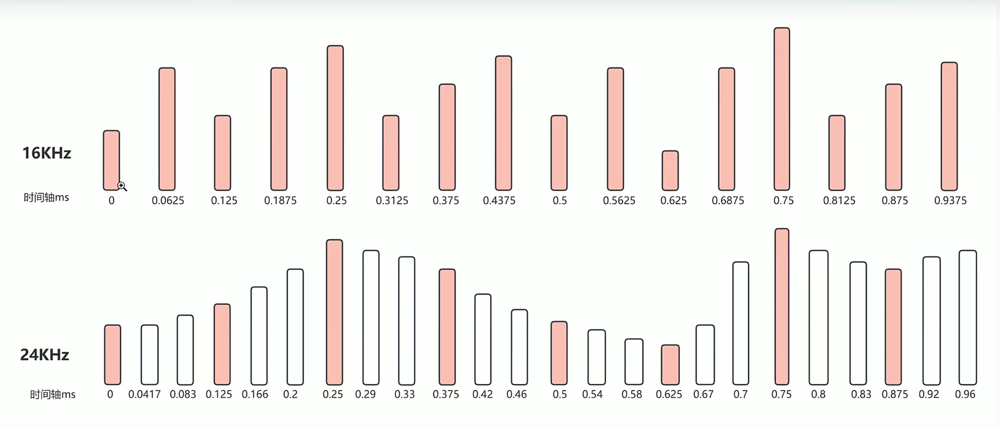
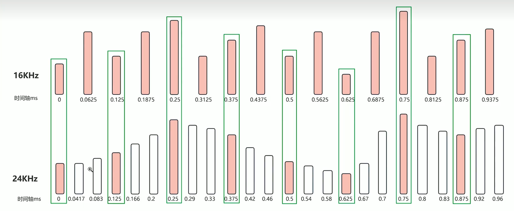

# 1. 实现MP3转P3
## 1.1 创建虚拟环境 
```conda create -n mp3ToP3 python=3.10 -y```

## 1.2 下载 p3_tools.zip 进入环境后:
```pip install -r requirements.txt```

## 1.3 执行转换:
```python convert_audio_to_p3.py input.mp3 output.p3```

## 1.4 播放p3:
```python play_p3.py output.p3```





